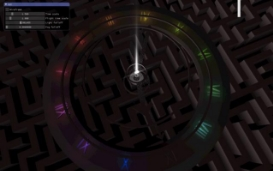
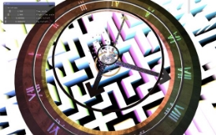
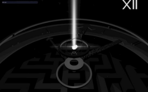
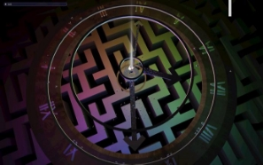
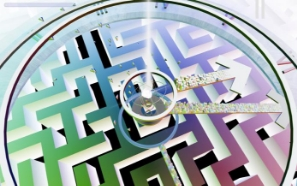
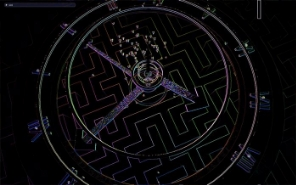

# On The Clock

Projet d’informatique graphique INF443 – par KHAWAND Joe et WORINGER Paul

## Description du scénario

Placé dans un appartement morne et sans vie, le personnage de l’histoire remarque que son
horloge dysfonctionne. Il tente de s’en approcher pour la réparer mais il est happé par une
force mystérieuse qui le projette dans un monde parallèle. Il se retrouve ainsi coincé à
l’intérieur de son horloge, où il doit faire face à de nombreuses épreuves hautes en couleur
pour redonner vie au mécanisme.

Cette aventure presque poétique confronte le joueur à la notion du temps et lui fait
questionner son sens de la réalité. Peut-il vraiment faire confiance à ses yeux? Va-t-il parvenir
à s’enfuir de cet univers absurde?

## Implémentation

Ce projet a été codé en C++ et GLSL, en utilisant la librairie OpenGL et la bibliothèque CGP.

### Architecture du projet

Ce projet comporte trois scènes. La première scène représente un appartement, assez simple
et sans particularités notables, hormis pour l’horloge qu’il contient.

Après avoir cliqué sur l’horloge, l’utilisateur est téléporté dans la scène principale : un
immense monde horloge. Au-dessus d’un labyrinthe qui s’étend à perte de vue se dresse un
mécanisme horloger, qui est initialement à l’arrêt. Au centre de la structure se trouve un nexus
d’énergie qui lance le mécanisme de l’horloge quand on appuie dessus. Activer les nexus
secondaires disséminés sur les chiffres du cadran de l’horloge ramène les couleurs au monde
et accélère la « vitesse » du temps, mais déclenche également des effets visuels plus
surprenants les uns que les autres.

A mi-chemin dans la réparation de l’horloge vient une autre surprise : l’utilisateur est déplacé
dans une dernière scène, qui représente un terrain de basket. Une fois qu’il a marqué un
panier, l’utilisateur est ramené dans la scène principale pour finir de réparer l’horloge. Une
extension possible de ce projet, mais qui est beaucoup trop conséquente pour que l’on puisse
l’implémenter dans les délais imposés, serait de lancer un mini-jeu par nexus secondaire activé
(ce qui aurait également donné plus de cohérence à l’ensemble, la scène de basket pouvant
sembler détoner dans le projet tel qu’il est actuellement).

  

*Scène initiale, scène de l’horloge, et scène du basket* 

### Construction du labyrinthe

Le labyrinthe délimite la vision de l’utilisateur vers le bas et cadre le regard sur le mécanisme
de l’horloge. Pour le produire, nous utilisons un parcours en profondeur sur les cases du
labyrinthe, en ajoutant dans un ordre aléatoire les cases voisines de la case traitée à la pile
d’appels à chaque étape. Le labyrinthe est donc différent à chaque lancement du programme.
Cela permettrait notamment de l’utiliser dans le cadre d’un des mini-jeux envisagés en
supplément, comme mentionné plus haut.

Une fois la matrice du labyrinthe produite, pour l’afficher nous avons d’abord produit un
mesh_drawable par case du labyrinthe, ce qui donnait pour un labyrinthe en 2D un résultat
de 1fps... Nous avons donc produit un unique objet à envoyer au GPU en concaténant des
quadrangles, ce qui nous a permis d’avoir des performances normales même pour un
labyrinthe en 3D. Nos machines étant assez anciennes, nous avons réduit la taille du labyrinthe
pour alléger la charge de calculs et récupérer des fps, mais un labyrinthe plus large éviterait
d’en apercevoir les bords, comme c’est parfois le cas actuellement.

### Techniques de modélisation de base utilisées

L’immense majorité des objets présents dans la scène ont été créés à la main. Nous avons fait
appel à quelques fonctionnalités de la bibliothèque CGP (mesh_primitive_cylinder,
mesh_primitive_quadrangle, ...) pour nous aider dans la construction d’objets plus complexes
tels que le labyrinthe. Les cylindres creux de la scène sont ainsi composés de deux cylindres
de CGP que l’on a reliés entre eux. Pour construire la base (texturée en bois) du mécanisme,
nous avons procédé de même, puis nous avons déformé le mesh afin d’obtenir ce pseudo-
cylindre à coupe trapézoïdale, puis nous avons travaillé par tâtonnement pour trouver un
plaquage de texture convenable.

Les flèches et les bâtiments dessus ont été produits en plaçant les points manuellement, en
prenant soin de dupliquer les arêtes pour éviter que le shader n’arrondisse les angles.

Les éléments de la scène initiale (appartement, horloge) et la forme des vaisseaux sont les
seuls objets que nous avons importés.

### Les nexus – hiérarchies et surface implicite

Le nexus central et les nexus auxiliaires ont la même structure hiérarchique. Nous avons choisi
de faire tourner les anneaux avec des vitesses dont le rapport est irrationnel pour éviter un
retour du nexus à l’état plan initial.

Le noyau du nexus central est produit par surface implicite, en prenant comme fonction
d’espace une somme de trois gaussiennes dont les centres se déplacent. Nous faisons varier
le paramètre de bruit au cours du temps pour donner un aspect plus dynamique et
imprévisible au rendu. Des billboards semi-transparents sont utilisés pour représenter un
rayon qui sortirait du noyau d’énergie.

### Les vaisseaux (boids)

Ils sont implémentés en suivant le modèle de boids classique. Ils suivent les trois règles de
comportement suivantes :

- Ils essayent de se regrouper avec les autres vaisseaux à proximité,
- Ils s’éloignent des vaisseaux situés trop près d’eux,
- Ils alignent leur direction avec celles des autres vaisseaux à proximité.
Ils sont de plus confinés dans un volume centré sur l’origine du repère du monde. Ils sont
initialement à l’arrêt, et ne commencent à se déplacer qu’à partir de l’activation du cinquième
petit nexus.

### Mécanismes de jeu

Nous avons implémenté une caméra volante qui permet à l’utilisateur de se déplacer dans le
monde horloge. Le mouvement de la caméra est cependant restreint dans la scène du basket
(où il est uniquement possible de tourner la caméra, sans se déplacer) et dans la scène initiale
de l’appartement (où tout mouvement est interdit).

Nous avons implémenté un mécanisme de picking pour permettre à l’utilisateur de cliquer sur
les nexus et sur l’horloge. Des instructions s’affichent pour guider l’utilisateur par le biais d’un
billboard semi-transparent placés devant la caméra avec différentes textures de texte
(produites sur un site qui convertit du texte en fichier .png).

Nous affichons également dans un environnement à projection orthogonale le nombre de
nexus qu’il reste à activer (en chiffres romains). Cette technique permet de placer ce nombre
en haut à gauche de l’écran indépendamment de la taille de la fenêtre, mais est vulnérable
aux déformations de cette-dernière, qui peuvent « écraser » l’image selon une direction.

### La scène de basket

Elle apparaît après l’activation du sixième nexus. L’ensemble de la scène est placé dans une
skybox de coucher de Soleil.

Le filet du panier est modélisé par un système de poids-ressorts. Ce-dernier, ainsi que le ballon
de basket, sont animés par modèle physique. En bloquant la visée du joueur dans le plan (xOz)
nous pouvons gérer les collisions du ballon avec le panier en ne considérant que le centre du
ballon, la portion de plan que représente le panneau du panier, et les deux points de l’anneau
dans le plan de la trajectoire. Pour la gestion des collisions entre le filet, nous avons simplifié
la chose en supposant la masse de la balle suffisamment grande pour que la balle ne soit pas
affectée, et que seul le filet se déforme. Un mécanisme de détection de victoire ayant été
ajouté, cela ne pose pas de problème visuel puisque l’utilisateur est assez rapidement ramené
dans la scène principale de l’horloge après avoir marqué.

### Travail sur les shaders et le visuel du rendu

Tous les shaders ont été modifiés pour modéliser une atténuation de la luminosité des sources
lumineuses avec la distance, et un effet de brouillard qui fait disparaître les éléments au loin
dans l’obscurité. Un gradient de noir a également été ajouté en fonction de la coordonnée z
pour donner l’impression que le labyrinthe émerge des ténèbres (cela se voit particulièrement
bien si l’on déplace la caméra en dessous du labyrinthe, comme ci-dessous.

*Labyrinthe vu de dessous avec le gradient de noir* 

 

*A gauche : forte atténuation de la lumière, à droite : aucune atténuation* 

L’effet de brouillard a également été utilisé pour faire disparaître les objets dans la pénombre
lors des transitions entre deux scènes.

L’essentiel du travail sur les shaders a été consacré à la scène principale. Nous y avons placé
plusieurs lumières, chacune avec sa propre couleur et son statut, allumée ou non (voir images
ci-dessus). Nous avons également fait en sorte que lorsque toutes les lumières sont éteintes,
ce soit la lune, et non pas une lumière ambiante, qui apporte de la lumière à la scène, en
simulant une lumière qui venait de sa direction dans la skybox.

Au début, le monde s’affiche en noir et blanc, sans textures. L’activation du premier petit
nexus apporte la couleur rouge au monde, qui se répand graduellement en partant du centre.
Le deuxième apporte le bleu, le troisième le vert, et le quatrième les textures (le cinquième
active les boids et le sixième transporte le joueur dans la scène de basket). Le dixième nexus
déclenche une inversion globale des couleurs.

 

 

*En haut à gauche le monde en noir et blanc, en haut à droite les couleurs normales, en bas à gauche les couleurs inversées, et en bas à droite le résultat du frame buffer en passages multiples* 

Enfin nous avons ajouté un buffer à passages multiples qui détoure les objets en faisant
apparaître les frontières contrastées. Pour l’activer/le désactiver il suffit de cliquer sur le nexus
central (il fonctionne également dans la scène du basket !).
